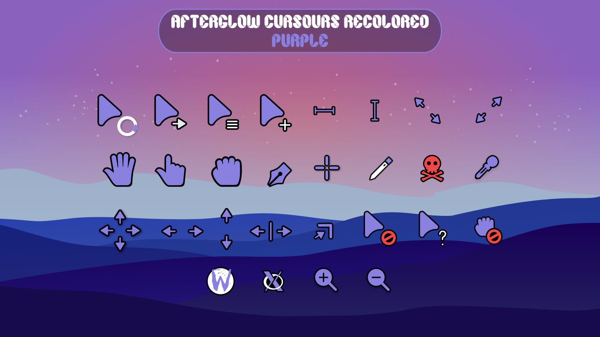

[](https://ko-fi.com/D1D5ERHKP)

# Afterglow cursors
This is an x-cursor theme inspired by the orignal [Afterglow Cursor pack](https://github.com/yeyushengfan258/Afterglow-Cursors) but recolored, originally based on macOS and the [capitaine-cursors](https://github.com/keeferrourke/capitaine-cursors).

## Installation
To install the cursor theme simply copy the compiled theme to your icons
directory. For local user installation:

```
./install.sh
```

For system-wide installation for all users:

```
sudo ./install.sh
```

Then set the theme with your preferred desktop tools.

## Alternative Colors
To use the script to install the other colors (until I learn if it's possible to script it) copy the contents inside of the `color/` you want into the `src/` folder, then you have to modify line 64 of the build.sh to say the color you're using, for example `THEME="Afterglow Purple"`.
Then modify lines 13,14 & 16 & 17 of install.sh to say the color you're using, for example if `[ -d "$DEST_DIR/Afterglow-Cursors-Recolored-Purple" ]; then`

## Building from source
You'll find everything you need to build and modify this cursor set in
the `src/` directory. To build the xcursor theme from the SVG source
run:

```
./build.sh
```

This will generate the pixmaps and appropriate aliases.
The freshly compiled cursor theme will be located in `dist/`

## Preview


## Preview Alt-colors

