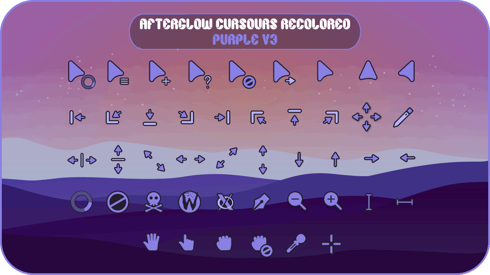
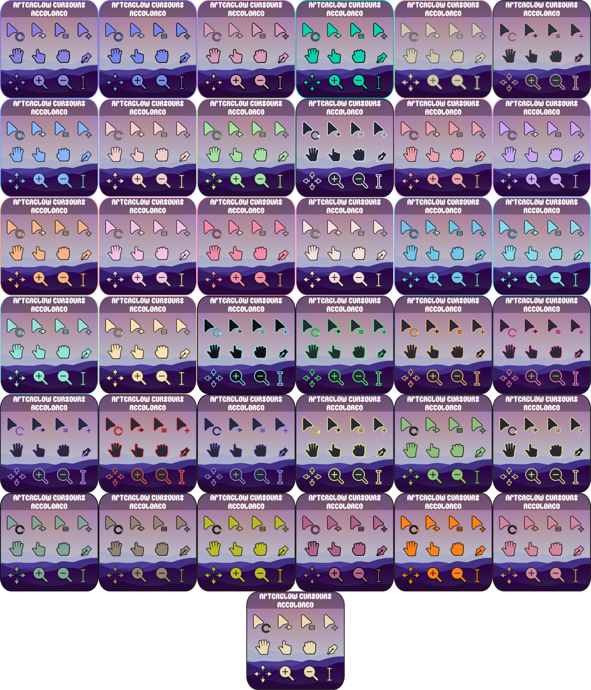

<div align = center>

# Afterglow cursors
This is an x-cursor theme inspired by the orignal [Afterglow Cursor pack](https://github.com/yeyushengfan258/Afterglow-Cursors) but recolored, originally based on macOS and the [capitaine-cursors](https://github.com/keeferrourke/capitaine-cursors).

I enjoyed using this cursor pack and then thought it would be a good idea to make special colors for myself and others. If you'd like to suggest colors you'd like, please submit a request.

If you'd like to support me on Ko-fi it's appreciated, takes time to make each recolor and test them.

[](https://ko-fi.com/D1D5ERHKP)
</div>

## Installation
To install the cursor theme simply copy the compiled theme to your icons
directory. For local user installation:

```
./install.sh
```

For system-wide installation for all users:

```
sudo ./install.sh
```

Then set the theme with your preferred desktop tools.

## Alternative Colors
To install the alternative colors you MUST use the `install.sh`inside the folder of the color you want.

## Building from source/Customize the Cursor
You'll find everything you need to build and modify this cursor set in
the `src/` directory. To build the xcursor theme from the SVG source
run:

```
./build.sh
```

This will generate the pixmaps and appropriate aliases.
The freshly compiled cursor theme will be located in `dist/`

<div align = center>

# Preview

### (Check [/previews](https://github.com/TeddyBearKilla/Afterglow-Cursors-Recolored/tree/main/previews) for all colors)

# Cursors made as of July 13th

</div>
